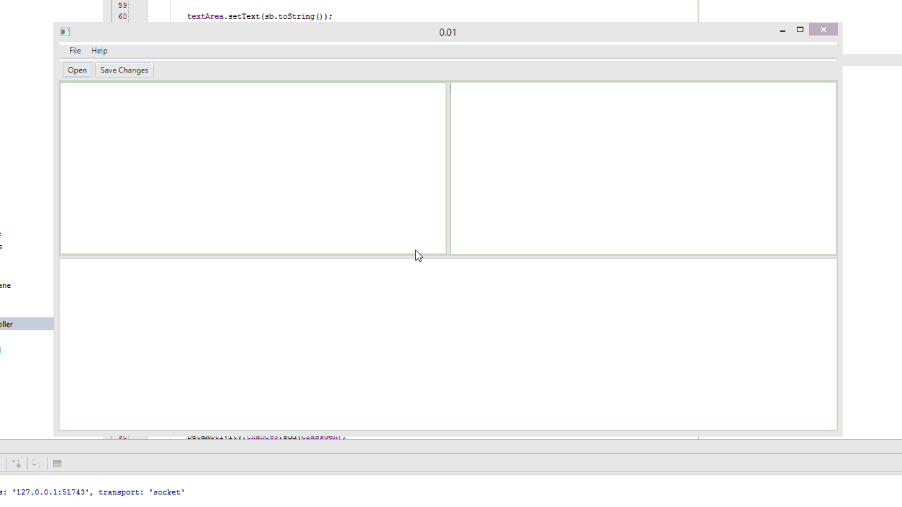

jbedit
======

jbedit is a tool that visualizes information about Java class file. 
With this tool you can modify bytecode and cosntruct a graph of bytecode instructions.

This requires java8.

mini demonstration:

Step for using:

1) Install maven
2) to do mvn clean install
3) mvn package and run

I recommend to run this project in ide, because its not finished.
